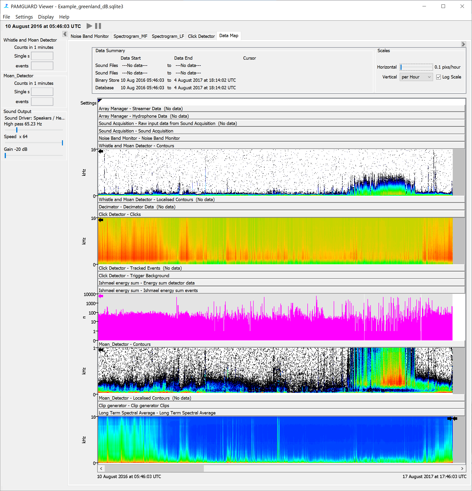
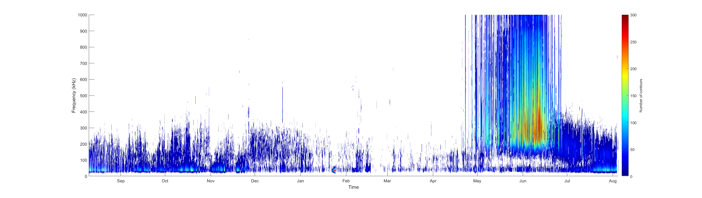

# pamguardDatagram

Generate datagrams from data processed in [PAMGuard](https://www.pamguard.org/)

## Introduction 
PAMGuard is an open source acoustic analysis toolbox designed to detect, classify and localise the vocalisations of soniferious marine mammals (baleen whales, sperm whales, dolphins, river dolphins, beaked whales, porpoise) and some terrestrial species such as bats. PAMGuard can analyse years of acoustic data and store relevant detections, classifications and metrics such as noise/long term spectral averages etc. in a highly compressed "binary file" format. This means that terabytes of acoustic data can be reduced by 99.9% in size whilst retaining sufficient information to allow manual analysts to inspect data and re-run classification algorithms or in real time operation allows users to store only relevant data. 

<center></center>
An example of a years worth of data analysed using PAMGuard tonal and click detectors alongside a long term spectral average. 

## pamguardDatagram
PAMGuard binary files can be loaded into PAMGuard where a user can access the multide of interactive displays or accessed through [R](https://github.com/TaikiSan21/PamBinaries) and [MATLAB](https://github.com/PAMGuard/PAMGuard/) libraries for more bespoke analysis. pamguardDatagram is a set of MATLAB functions which both recreates the PAMGuard datagram showing a summary of months or even years of acoustic data and compiles a set of useful summary metrics for further data analysis. 

## Usage
pamguardDatagram requires the PAMGuard [MATLAB library](https://github.com/PAMGuard/PAMGuard/) which should be added to your MATLAB path. Building a datagram also requires acoustic data to have been analysed in PAMGuard and saved to PAMGuard binary files (see pamguard help -> Binary File Module). 

There are two inputs to the datagram folder; a path to the binary file folder and a ```datatype```. ```dataype``` is an integer number and indictaes which data stream you wish to analyse. Current enabled ```datatypes``` are:

- 1 -> Click detections from the Click Detector Module.
- 2 -> Whistle and Moan detections from the Whistle and Moan detector Module. 
- 3 -> Noise Band monitor
- 4 -> LTSA

## Example code 

```Matlab
% binary data folder
binaryFolder = 'E:\Google Drive\SMRU_research\Gill nets 2016-20\SoundTrap_4c\20191114_Cornwall_AK627_H3\67170312\Binary\';
% binaryFolder='D:\Greenland\Tuttulipaluk2016-17\pamguard\binary\'; 

datatype=2; % the data type 1 for clicks, 2 for whistles. 
sR = 48000; %sample rate in samples per second. 
timebin =60; % the time bin in which to calculate each datagram line in seconds. 

fftLength = 1024; % the fft length used in PAMGuard in samples (only required for whistles)

%% create the datagram
[datagram, summarydata, metadata] = loaddatagram(binaryFolder,datatype,...
    'TimeBin', timebin, 'FFTLength', fftLength);

%% plot the datagram
metadata.sR = sR; % need add sample rate to the metadata
[s, c] = plotdatagram(datagram, metadata, 'UsekHz', false); 
```

## Output
The output can be plotted using ```plotdatagram```

<center></center>
A whistle datagram calculated using pamguardDatagram: this is the same data as the second from bottom panel in the first figure. 

Each datagram also has an associated _ _summarydata_ _ variable. This holds bespoke metrics for each datagram bin. For example a click datagram has the number of classified and unclassified clicks and recieved amplitude distributions. The descriptions of the data contained in _ _summarydata_ _ can be found in the _ _metadata_ _ output. 

## Versions
Version 1.1 - 07/05/2020 first release. Added noise datagram. Datatype = 3; 

Version 1 - 05/05/2020 first release. Only enabled for Whistles and Clicks. Noise band monitor coming soon. 

